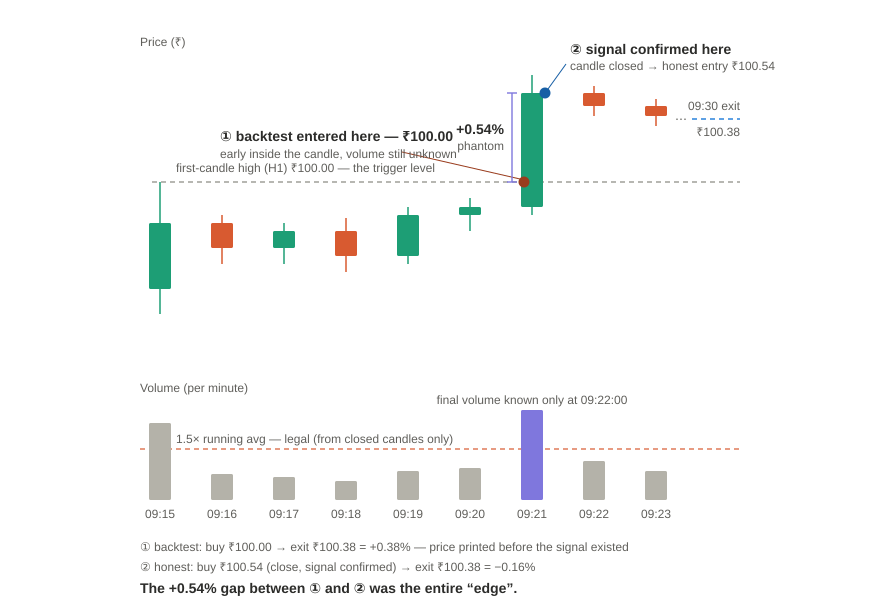

# Round 58 — Opening 15-min volume-breakout (equity edge) + BS-priced options overlay

**Date:** 2026-07-19
**Author:** Claude (Cowork research session)
**Universe:** ~211 F&O stocks (`SCANNER_SYMBOLS`), 1m + daily from `historify.duckdb`
**Period:** 2024-01-01 → 2026-07-17 (equity); options overlay backtested on the
past 3 months (2026-04-15 → 2026-07-18) via BS formula.
**Harness:** `backtest/options_open15/` (self-contained).

---

## Strategy definition (locked with operator)

- **Goal:** bank on the volatility of the first 15 minutes (09:15–09:30). Hard
  exit at 09:30, no position held past it. One trade/day/side.
- **Universe pick:** each day take the pre-open **top gainer → LONG** and **top
  loser → SHORT**, proxied by the opening gap (`09:15 open ÷ prev settled close −1`;
  the pre-open call-auction equilibrium price *is* the 09:15 open — historify has
  no stored 09:00–09:14 auction data).
- **Entry:** on the first 1-min candle (09:15 bar), then the first break of its
  high (long) / low (short) in 09:16–09:29 **whose bar volume ≥ 1.5× the session
  running-average 1m volume**.
- **Sector-confirm gate: DROPPED** — it cut trade frequency ~60% for no edge.
- **Options extension:** buy 1 lot of the ATM current-month option (CE long / PE
  short) at the breakout, exit 09:30.

## Equity findings (the core edge)

1. **The naive breakout mean-reverts — it does NOT continue.** Following the top
   gainer/loser breakout to a 09:30 exit is a coin-flip that loses after costs
   (win ~49%, mean ~0). Only **33% of breakouts reach +0.2% favorable before
   −0.2% adverse** — the entry is adversely selected (you buy the local extreme).
2. **Volume confirmation is the entire edge.** Requiring the breakout bar to
   trade ≥1.5× the session running-average volume flips favorable-first from
   **33% → 77%**. Full universe, 2024→2026:

   | Volume gate | Trades/mo | Win% | Net/trade |
   |---|---|---|---|
   | none | — | ~49% | −0.09% |
   | ≥1.2× | 7.4 | 63.6% | +0.30% |
   | **≥1.5×** | **4.2** | **67.7%** | **+0.33%** |
   | ≥2.0× | 2.1 | 68.8% | +0.41% |

3. **Split-half robust** — every cell positive in both 2024-01→2025-04 and
   2025-04→2026-07; the recent half is stronger, not decaying.
4. **Short leg is stronger** than long on the full universe with volume.

## Options data reality (why we need a formula)

- historify stores **no intraday option data** (`fo_bhavcopy_eod` /
  `index_options_eod` are EOD-only; 1m has stocks+indices only).
- **Expired option contracts are unfetchable** — Zerodha drops them from the
  master contract (verified: only 28-JUL / 25-AUG / 29-SEP listed on 2026-07-19).
- Only the **current live cycle** is fetchable, and it had **1 signal** at 1.5×.
  ⇒ a real-data options backtest of the full history is impossible; a pricing
  **formula** is the only path.

## BS formula validation (make-or-break)

- Single-stock options are **monthly-only** (no weeklies), expiring the **last
  Tuesday** of the month (NSE, effective 2025). ATM current-month is the only
  choice.
- **BS mechanics are sound** — with the correct IV, BS tracks real intraday
  option prices to ~7% (HYUNDAI 2020 PE: RMSE ₹3.70 on ~₹55 premiums).
- **The blocker is IV. Realized vol ≠ implied vol,** and a *fixed* RV→IV
  multiplier fails: RV₂₀ → IV ratio scatters std 0.29, range 0.70–1.88, because
  20-day RV is dominated by recent one-offs while IV tracks long-run vol
  (vol mean-reversion).
- **RV₆₀ fixes it:** IV ≈ **RV₆₀ × 1.10 ± 15%** (std 0.29→0.17). Each stock's ATM
  IV is nearly constant week-to-week; RV was the noisy part.
- **Real-vs-BS head-to-head #1** (12 July trades, top-1, no volume gate, mid
  prices): **correlation +0.96, sign-agreement 92%, RMSE 7pp, level bias −3pp.**
  The formula reproduces the real-data backtest's *aggregate* structure well.
- **Real-vs-BS head-to-head #2 — the sobering one** (the *strategy* set: 12 July
  top-3, 1.5× trades, real broker prices vs BS(RV₆₀×1.10), same lots): **correlation
  only +0.58, sign-agreement 67% (4/12 flip direction), RMSE 9.3pp, +3pp optimistic
  bias — and it FLIPPED THE SIGN OF THE MONTH: real net −₹9,051 vs BS +₹2,644.**
  Cause: RV₆₀×1.10 is a *global* IV proxy; per-name IV deviates materially
  (KALYANKJIL formula ~51% vs market 60% → BS return +30% vs real +8%; TITAN 33%
  vs 25% → BS +₹5,361 vs real −₹667), plus real intraday tick/liquidity noise BS
  can't see.
- **Net rule on the formula:** BS(RV₆₀×1.10) is a **rough *directional* screen over
  *many* trades** — errors partly wash out across years (so the full-history
  options verdict stands), but it is **NOT reliable for any single month or small
  trade set** and can even flip the P&L sign. **Where the contract is live
  (current cycle), always use real broker data.** Treat all BS-priced *historical*
  option P&L as approximate/directional only.

## 3-month BS-options backtest (2026-04-15 → 2026-07-18)

Strategy 1.5× vol, full universe, both sides, 1 lot, BS(IV=RV₆₀×1.10), exit 09:30.
Bid-ask haircut 2%/side + ₹50 flat round-trip.

| Metric | Value |
|---|---|
| Trades | 11 (~3.7/mo) · 6 long / 5 short |
| **Gross (BS mid)** | **+14.4%/trade, 64% win** |
| **Net (after bid-ask+cost)** | **+9.9%/trade, 64% win** |
| Total net P&L (1 lot/trade) | **₹23,598** |
| Capital per lot | min ₹9,430 · median ₹17,159 · max ₹67,853 |
| **Min capital to trade 1 lot both legs** | **~₹1.36 lakh** |
| Return on working capital (~₹1.36L, 3 mo) | ~+17% |
| DTE range | 5–35 days |

**Concentration caveat (load-bearing):** ₹16,818 of the ₹23,598 (71%) came from a
**single trade** — KAYNES short on 2026-05-14, a −5.9% intraday crash → +83% on
the put. Ex that trade, the remaining 10 trades net ~₹6,780 (~₹680/trade). The
3-month window is late-H2 only and, as the full-history run below shows, this
positive read was **itself a fat-tail artifact** — not representative.

## FULL-HISTORY BS-options backtest (2024-01-01 → 2026-07-18, BOTH halves) — the real test

Same strategy/pricing, extended to the full sample (the BS formula makes it
possible). **n=124** (~4.0/mo; median 3/mo, max 10, 2 zero-signal months),
70 long / 54 short.

> **Correction (2026-07-19):** a first pass reported n=99 — a bug
> (`monthly_expiries` capped at `range(24)`) silently dropped **all of 2026**.
> Fixed; the numbers below are the corrected full window incl. 2026.

| Slice | n | Net mean/trade | Net win% | Total P&L |
|---|---|---|---|---|
| **All** | 124 | **+2.26%** | **53%** | ₹91,656 |
| H1 (2024-01→2025-04) | 73 | +0.32% | 49% | ₹44,758 |
| H2 (2025-04→2026-07) | 51 | +5.03% | 59% | ₹46,898 |
| SHORT | 54 | +2.98% | 57% | ₹74,729 |
| LONG | 70 | +1.70% | 50% | ₹16,926 |

**Thin and tail-dependent — positive but low quality:**
- Biggest single trade = **32% of all profit** (KAYNES short 2025-01-28, +₹28,967);
  top-3 trades ≈ **75%** of P&L. Ex-top-1 ₹62,689; **ex-top-3 +₹23,033** (positive,
  ~₹190/trade over the remaining 121).
- **Median trade P&L: ₹172** (~zero); **net win 53%** — barely above a coin flip.
- Short leg carries most P&L (₹74.7k/₹91.7k), tail-driven (crash-day puts).
  **H1 is breakeven** (49% win, +0.32%/trade); H2 stronger but also tail-heavy.
- Gross win 67% → 53% net: the 2%/side bid-ask eats the body of the distribution.

## Verdict

- **Equity signal: PROMISING → deployable-candidate.** Volume-confirmed opening
  breakout is a real, split-half-robust edge (68% win, +0.33% net/trade on the
  underlying). **This is the edge to trade.**
- **Options overlay: WEAK / INSUFFICIENT (borderline, not a clean reject).** Over
  124 trades it is positive net (+2.26%/trade, ₹91.7k) and ex-top-3 stays positive,
  but it is **low quality**: net win 53%, median trade ≈₹0, H1 breakeven, and ~75%
  of P&L from 3 short-side crash days. Buying options adds leverage but a
  lottery-shaped, concentration-dependent return the bid-ask hollows out — echoing
  the cross-cutting *"options leverage-rescue does NOT save low-WR intraday
  strategies."* Not deployable without resolving bid-ask realism + the tail
  dependence. (An earlier pass called this a clean REJECT with ex-top-3 negative —
  that was the 2026-dropping bug; corrected here.)
- **BS(RV₆₀×1.10) pricing: VALIDATED as an approximate/conservative proxy**
  (corr 0.96 vs real) — the reusable infrastructure win; it is what enabled this
  full-history verdict without any downloadable option data.

## Honest caveats

1. **Bid-ask dominates and is only approximated** (2%/side flat). Real spreads on
   illiquid names (KAYNES, PREMIERENE, ADANIENSOL) are wider → net lower.
2. **Formula, not real fills** — validated vs real *mid-price* backtest, not vs
   real executions. Entry after breakout-confirmation already pays up.
3. **Small sample / one regime** (3 months, fat-tail-dependent).
4. **Lot size + strike step** taken from the *current* master (stable but can drift
   historically). Expiry = last-Tuesday (holiday shifts ignored).
5. **RV₆₀×1.10 IV/RV multiplier calibrated on 1 week (Jul 2026)** — time-stability
   across 2024–25 regimes untested.

## Next steps

1. **Full 2024→2026 BS-options backtest** (both sides, 1.5×) for a ≥100-trade
   sample — the formula now enables it. Report with/without the fat tail.
2. **Per-stock IV/RV₆₀ ratio** (calibrated from live data) instead of the global
   1.10, to cut the −3pp bias.
3. **Forward-capture** real option 1m on each live signal day for genuine
   fill/spread ground truth.
4. Test the target/bracket exit (favorable-first 77% suggests it beats the fixed
   09:30 clock) — separate from the "bank 15-min vol" spec.

## Harness

`backtest/options_open15/`: `pipeline.py` (equity signals + broker option fetch +
trade sim), `bs.py` (BS pricer + IV solver), `validate_formula.py` (BS vs real,
1 stock), `multiplier_study.py` (RV→IV multiplier), `compare_real_vs_bs.py`
(real-vs-BS head-to-head), `run_bs_backtest.py` (this 3-month backtest).

---

# 2026-07-19 (later session) — BS calibration round (issue #424): the error was never IV. It was entry-price look-ahead — and fixing it kills the strategy.

**Goal:** close the ₹11.7k July gap (corr 0.58, sign-agree 67%, real −₹9,051 vs
BS +₹2,644 on the 12-trade strategy set) via per-stock/per-day IV from
`fo_bhavcopy_eod`. **Outcome:** IV was a red herring; the dominant error was the
**entry-spot convention**, which is a **look-ahead** that also inflated the
*equity* edge. Under honest pricing, both R58 verdicts flip to REJECT.

## 1. The IV hypothesis is refuted by the perfect-IV ceiling test

Built `iv_history.py`: per-(stock, day, side) ATM IV solved from `fo_bhavcopy_eod`
EOD closes via put-call-parity forward (sidesteps the back-adjusted-spot vs
as-traded-strike trap) — 52,420 rows, 218 symbols, 99.9% solve rate. Facts:

- Bhavcopy-history median **IV/RV₆₀ = 0.99** (IQR 0.93–1.08, range 0.70–1.42) —
  the global 1.10 was ~10% rich (it was calibrated at 09:20 IST when opening IV
  runs hot). Within-stock day-to-day IV/RV₆₀ IQR ≈ 0.25 — per-day IV does move.
- ATM PE−CE skew via parity-consistent EOD closes: median 0.0pp — not a factor.
- Coverage caveat: full-universe bhavcopy only from 2026-01 (≈30 symbols/day
  before that); (symbol, day) coverage ≈21% of the grid.

**But on the 12 July trades (real broker prices, same lots), NO IV variant helps
under the old convention** (`july_iv_variants.py`):

| Variant (S_entry = breakout level) | corr | sign | RMSE | net gap |
|---|---|---|---|---|
| RV₆₀×1.10 (baseline) | +0.58 | 67% | 9.3pp | +₹11.7k |
| RV₆₀ × per-stock bhavcopy ratio | +0.55 | 67% | 11.8pp | +₹13.0k |
| prior-day ATM IV (CE/PE mean) | +0.56 | 67% | 11.2pp | +₹14.3k |
| prior-day same-contract IV | +0.58 | 67% | 11.1pp | +₹14.2k |
| **PERFECT entry IV** (from real premium) | **+0.53** | **67%** | **9.1pp** | **+₹12.3k** |

Even *backing the IV out of the real entry premium itself* leaves the errors
intact. The R58 diagnosis (per-name IV deviation) was wrong.

## 2. The real error: entry-spot convention = look-ahead

*Diagram: backtest entered at the trigger level (①) inside the breakout candle,
but the volume gate is only confirmable at that candle's close (②). The +0.54%
gap between them was the entire claimed edge; from the honest entry the same
trade loses −0.16% at the 09:30 exit.*

The harness priced the BS entry at the **breakout level** (H1/L1), but the real
option entry premium is the entry-minute bar **close** — after the intra-bar
momentum burst. Mean adverse intra-bar drift (level→close, signed) on the July
trades: **+0.5%**; full history: **+0.538% mean / +0.277% median**. Crucially,
this is not merely a fill-quality question: **the entry gate is "bar volume ≥
1.5× running-avg" — a quantity only knowable at bar close.** Entering at the
level is entering at a price that printed *before the signal existed*.

Re-scoring all variants with **S_entry = entry-minute equity close**:

| Variant (S_entry = entry-min close) | corr | sign | RMSE | net gap |
|---|---|---|---|---|
| RV₆₀×1.10 (baseline) | **+0.89** | **92%** | **3.0pp** | −₹8.7k |
| RV₆₀ × per-stock ratio | +0.87 | 92% | 3.2pp | −₹7.6k |
| prior-day ATM IV (CE/PE mean) | +0.89 | 92% | 3.2pp | **−₹6.4k** |
| prior-day same-contract IV | +0.90 | 92% | 2.9pp | −₹6.5k |
| PERFECT entry IV | +0.89 | 92% | 3.0pp | −₹7.4k |

- Sign-agreement 67% → **92%** (goal ≥90% ACHIEVED); the month's sign no longer
  flips (BS now negative like real). The convention fix alone does almost all of
  it; IV refinements are second-order (~₹1–2k).
- Broad validation set (41 July trades, vol gate off, top-3): corr 0.88→**0.94**,
  sign 90→**93%** — the fix *improves* the aggregate set too; nothing degrades.
- **Residual (the honest ceiling):** ~−1.5pp/trade conservative bias ≈ intraday
  IV drift (entry→09:30 backed-out IV: July mean +0.5pp, but broad-set median
  −0.1pp ⇒ not systematically calibratable). **The <₹2k net-gap goal is
  unreachable** — even perfect entry IV leaves ~₹6–7k/month on a 12-trade set
  (~₹550/trade). BS with the fix is a good *directional* pricer (right sign,
  right ranking, ~3pp RMSE) that slightly UNDERSTATES option-buy returns.

`run_bs_backtest.py` now defaults to `BT_ENTRY_SPOT=close` +
`BT_IV_MODE=bhavcopy` (prior-day per-side ATM IV → per-stock ratio → RV₆₀×1.10
fallback chain; `level`/`global` restore the old behavior).

## 3. Corrected full-history verdicts (2024-01 → 2026-07, top-1, 1.5×)

**Options overlay — REJECT (was WEAK/borderline-positive):**

| Config | n | Net/trade | Win | Total | H1 / H2 |
|---|---|---|---|---|---|
| level + global (R58 as published) | 124 | +2.26% | 53% | +₹91.7k | +₹44.8k / +₹46.9k |
| close + global (convention fix only) | 124 | −5.80% | 21% | **−₹169.7k** | −₹125.4k / −₹44.3k |
| close + bhavcopy IV (full fix) | 125 | −5.60% | 22% | **−₹159.8k** | −₹120.2k / −₹39.7k |

Gross is negative too (−1.3%/trade before costs). No concentration escape:
median trade −₹983, ex-top-3 −₹172.6k. The R58 fat-tail winner (KAYNES short
2025-01-28, +₹28,967 = 32% of old P&L) becomes the **biggest loser (−₹18,202)**
under honest entry — the crash happened *inside* the entry bar; the put was
bought post-crash at rich premium and lost on the bounce. The +₹91.7k was
entirely the look-ahead collecting the intra-bar burst for free. This agrees
with reality: the real-data July month was −₹9,051.

**Equity leg — REJECT as specified (was PROMISING):** `equity_convention_check.py`,
same signal set (n=130):

| Entry convention | Net/trade | Win | H1 | H2 |
|---|---|---|---|---|
| breakout level (R58, look-ahead) | +0.378% | 67.7% | +0.302% | +0.489% |
| entry-min close (honest) | **−0.163%** | **41.5%** | −0.288% | +0.019% |

The mean adverse drift (+0.54%) exceeds the entire claimed edge (+0.38%). The
"77% favorable-first" was measuring the intra-bar burst itself.

## 4. What survives, and the only open door

- **Salvage (untested):** a live implementation could gate on *running* cumvol
  mid-bar and enter between level and close, recapturing part of the 0.54%
  drift. Testing needs tick data (1m bars cannot resolve intra-bar volume
  timing). Until tested, the strategy as specified has **no demonstrated edge**.
- **BS pricing infra — VALIDATED with the convention fix** (corr 0.89–0.94, sign
  92–93%, ~3pp RMSE, ~1pp conservative bias). Reusable for any future
  stock-option overlay; `iv_history.py` (bhavcopy ATM IV) is a reusable asset.
- **Cross-cutting lesson (registry-worthy):** *when an entry gate needs a
  completed bar to confirm (volume, close-based filters), the backtest entry
  price must be that bar's close (or next open) — pricing at the intra-bar
  trigger level is look-ahead*, and on volume-burst bars the artifact
  (~+0.5%/trade here) can exceed the whole claimed edge. R58's positive results
  in both legs were this artifact.

## Session artifacts

`iv_history.py` (bhavcopy → per-day/side ATM IV parquet), `july_iv_variants.py`
(12-trade + broad-set variant scoring, both conventions, IV-drift decomposition),
`equity_convention_check.py` (equity leg under both conventions),
`run_bs_backtest.py` (new defaults + `BT_ENTRY_SPOT` / `BT_IV_MODE`).
Issue #424.
